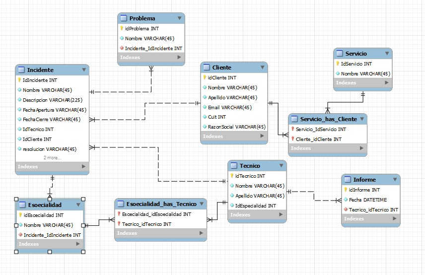

# TPI-JavaIntermedio-G9
Trabajo Práctico Integrador del curso Java Intermedio - Argentina Programa 4.0 - 2023

## Comisión 005 - Grupo 9
# Integrantes 
- GERARDO GABRIEL AGUILAR
- MATÍAS ADRIÁN BENEGAS
- ALICIA DURÁN
- MELODY IVANA FLORES
- TADEO TORRES MARTIN
- ALICIA VILLORDO

# Presentación
En el presente trabajo se realizó el desarrollo de un sistema que permite el seguimiento y generación de incidentes que se presentan en una empresa. 

## Modelado de datos

